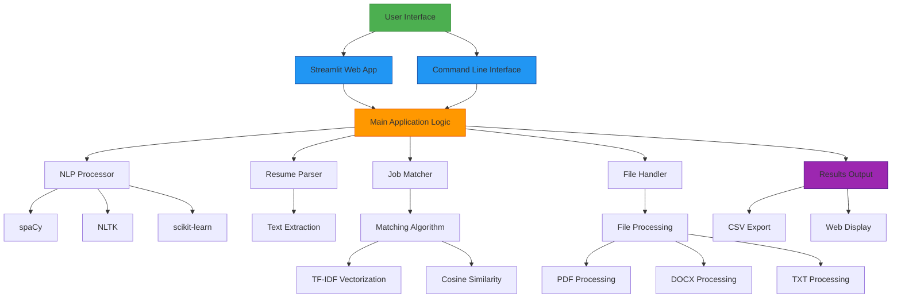

# System Architecture with Streamlit Enhancement

## Enhanced Architecture Diagram

## Component Interactions

### 1. User Interfaces
- **Streamlit Web App**: Provides an interactive web interface for users
- **Command Line Interface**: Traditional CLI access for automation

### 2. Core Application Layer
- **Main Application Logic**: Coordinates all system components
- **NLP Processor**: Handles text processing and analysis
- **Resume Parser**: Extracts information from resumes
- **Job Matcher**: Calculates match scores between resumes and job descriptions
- **File Handler**: Manages different file formats

### 3. External Libraries
- **spaCy**: NLP processing for named entity recognition
- **NLTK**: Text preprocessing utilities
- **scikit-learn**: Machine learning algorithms for similarity calculations
- **PDF/DOCX Libraries**: File format processing

### 4. Output Layer
- **CSV Export**: Structured data export for further analysis
- **Web Display**: Interactive results visualization in the browser

## Data Flow

1. **Input**: User provides resumes and job descriptions through either interface
2. **Processing**: 
   - Files are parsed and converted to text
   - Text is processed using NLP techniques
   - Information is extracted from resumes
   - Match scores are calculated using semantic analysis
3. **Output**: 
   - Results are displayed in the web interface with visualizations
   - Data can be exported as CSV for external use

## Benefits of Streamlit Integration

### Improved Accessibility
- No programming knowledge required to use the system
- Intuitive file upload interface
- Visual feedback during processing

### Enhanced User Experience
- Real-time results display
- Color-coded match scores for quick assessment
- Interactive data exploration

### Better Visualization
- Bar charts for match component analysis
- Ranked candidate lists with sorting capabilities
- Downloadable reports in standard formats

### Multi-Platform Support
- Works on any device with a web browser
- No installation required on client machines
- Consistent interface across operating systems