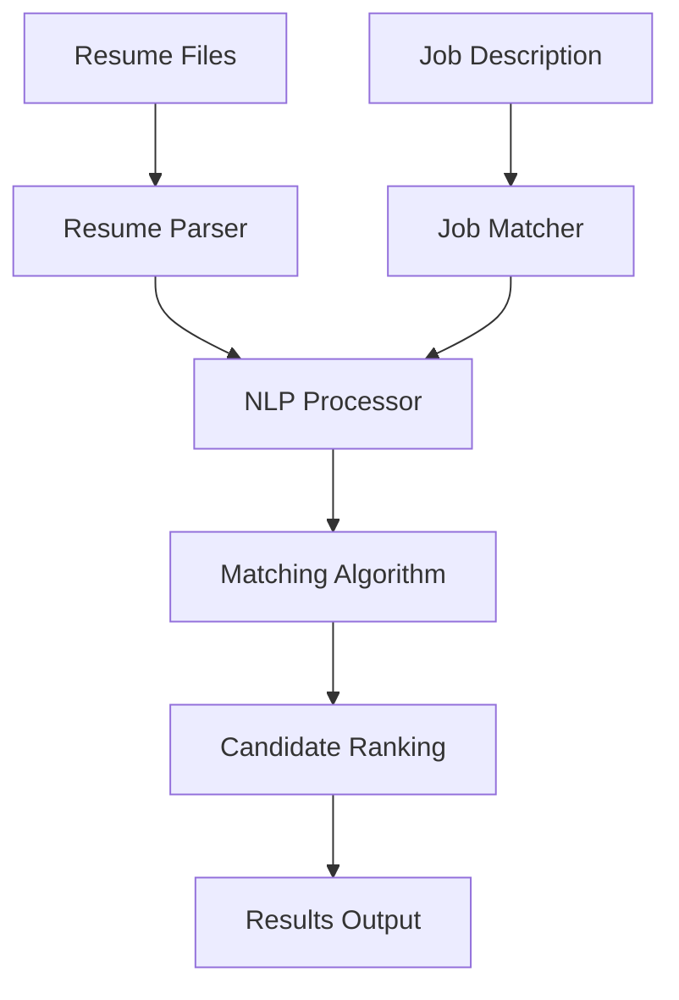

# Automated Resume Analysis System - User Guide

## Overview
The Automated Resume Analysis System is a powerful tool that uses Natural Language Processing (NLP) to parse resumes and job descriptions, extract key information, and rank candidates based on relevance scores. This system significantly reduces manual screening time and improves hiring efficiency.

## System Architecture

For detailed information about the system architecture including the Streamlit enhancement, see [Architecture with Streamlit](architecture_with_streamlit.md).



## Installation

### Prerequisites
- Python 3.6 or higher
- pip package manager

### Steps
1. Clone or download the repository
2. Install required packages:
   ```bash
   pip install -r requirements.txt
   ```
3. Install spaCy language model:
   ```bash
   python -m spacy download en_core_web_sm
   ```

## Usage

### Command Line Interface
Run the main application:
```bash
python src/main.py
```

### Web Interface (Streamlit)
Run the Streamlit web application:
```bash
streamlit run src/streamlit_app.py
```

For detailed information about using the web interface, see [Streamlit Interface Guide](streamlit_guide.md).

### Batch Processing
Process multiple resumes against a job description:
```bash
python src/batch_processor.py --resumes-dir data/resumes --job-description data/job_descriptions/software_engineer.txt
```

### Command Line Arguments
- `--resumes-dir`: Directory containing resume files
- `--job-description`: Path to job description file
- `--output`: Output file for results (default: results.csv)

## Supported File Formats
- Text files (.txt)
- PDF files (.pdf)
- Word documents (.docx)

## System Components

### 1. NLP Processor
Handles text preprocessing, keyword extraction, and similarity calculations using:
- spaCy for named entity recognition
- NLTK for text processing
- scikit-learn for TF-IDF vectorization and cosine similarity

### 2. Resume Parser
Extracts key information from resumes:
- Candidate name and contact information
- Skills and qualifications
- Work experience
- Education background

### 3. Job Matcher
Calculates match scores between resumes and job descriptions:
- Keyword similarity analysis
- Skills matching
- Experience requirements evaluation

## Output
The system generates:
1. Detailed candidate ranking with match scores
2. CSV/Excel file with results
3. Statistical visualizations (if matplotlib is available)

## Customization
You can adjust the matching algorithm weights in `config.py`:
- Keywords: 40%
- Skills: 40%
- Experience: 20%

## Troubleshooting
- If you encounter import errors, ensure all dependencies are installed
- For PDF processing issues, verify PyPDF2 is properly installed
- For Word document issues, check python-docx installation

## Contributing
Feel free to contribute to this project by:
1. Forking the repository
2. Creating a feature branch
3. Making your changes
4. Submitting a pull request